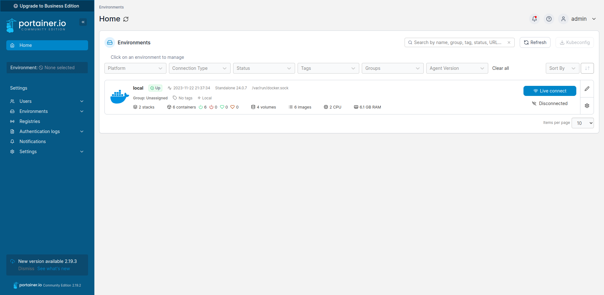

<h1>Docker</h1>
<h3>
1. Install Portainer
</h3>

<code>
docker pull portainer/portainer 
docker volume create portainer_data 
</code>

docker run -d -p 9000:9000 -v ~/portainer_data:/data -v /var/run/docker.sock:/var/run/docker.sock --name portainer portainer/portainer

<h3>
Install Odoo:17

</h3>

docker compose odoo17.yaml